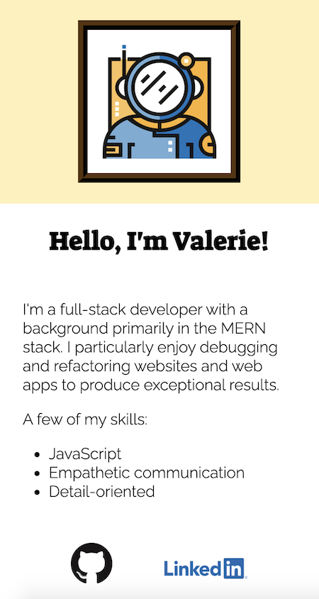

# Profile Generator

A command-line interface that allows a user to create and customize an HTML profile page.

## Description

This application utilizes back-end technologies such as Node.js and inquirer to accept and respond to user inputs. Users answer questions about themselves via the command-line, and their specified preferences are used to generate a customized profile.

One of the most interesting things I learned was how to assign a variable with a string, then remove the quotes from that string later on in the code. This was useful for the RGBA colors used in the various themes for the page. Since the HTML page is generated through fs, this was a great way to do a bit of inline styling to produce the desired result. Otherwise, an error would have occurred.

I also learned more about CSS by creating this application. I chose not to use Bootstrap so that I could get a bit more experience with custom CSS. It was a great reminder of the power of using flexbox containers.

A few ideas for future development include:

- Adding additional themes and avatar choices
- Adding additional questions
- Modifying the skills list to be one question and accept inputs via process.argv

## Technologies Used

- HTML5
- CSS3
- Node.js
- Inquirer

## Table of Contents

- [Installation](#Installation)
- [Usage](#Usage)
- [License](#License)
- [Contributing](#Contributing)
- [Tests](#Tests)
- [Questions](#Questions)
            
## Installation

For this application to run correctly on your local machine, install inquirer by running ```npm i``` in the working directory. Then, run ```node index.js``` to start the application.

A view of a dynamically generated profile:


A view of the same profile on mobile:



## Usage

This application is intended to create simple profile pages. Multiple pages can be created if desired, but should be named differently (i.e. a different first name should be used for each page).

## License

This project has not yet been licensed, and thus, standard copyright laws apply.
            
## Contributing

Valerie Russell is the sole contributor to this project.
            
## Tests

There are currently no tests written for this project.
            
## Questions

If you have any questions about this application my GitHub username is vruss14 and you can view my GitHub profile at https://github.com/vruss14.

If you have additional questions, feel free to reach out to me at vruss14@gmail.com.

